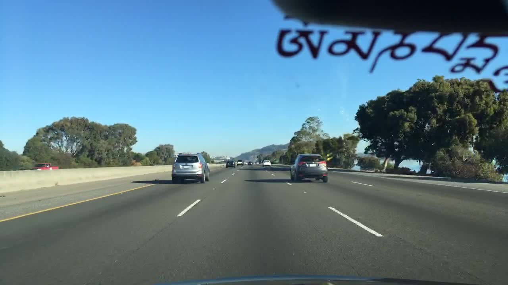
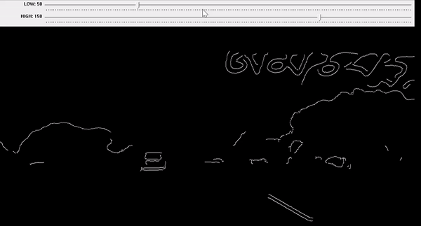

# Contents
- [Background](#background)
- [How to work](#how-to-work)
- [Snapshots](#snapshots)
 
# Background
- OS : Windows11
- IDE : Visual Studio 2022 Community
- dependency : **[opencv](https://opencv.org/)**
- Finding several parameters for pre-processing of an img when you want to get edge data of specifc area.
- Can be used with 2 different types of pre-processing in real-time.
    1. Canny-edge method
    2. Masking HLS color-space img 

# How to work
**1. Canny-Edge Trackbar :** Dragging either max or min threshold value on trackbar.
 
**2. HLS Trackbar :** Depend on your purpose, You can drag 6 parameters to mask each Color boundary.
 

# Snapshots
**1. Trackbar by [Canny-edge](https://docs.opencv.org/3.4/da/d5c/tutorial_canny_detector.html) algorithm method**
 
**2. Trackbar by masking specific [HLS](https://en.wikipedia.org/wiki/HSL_and_HSV) color element**

| Original Img  |  |
| :---: | :---: | 
| **Canny-edge Img** |  |
| **HLS Color mask Img** |  |